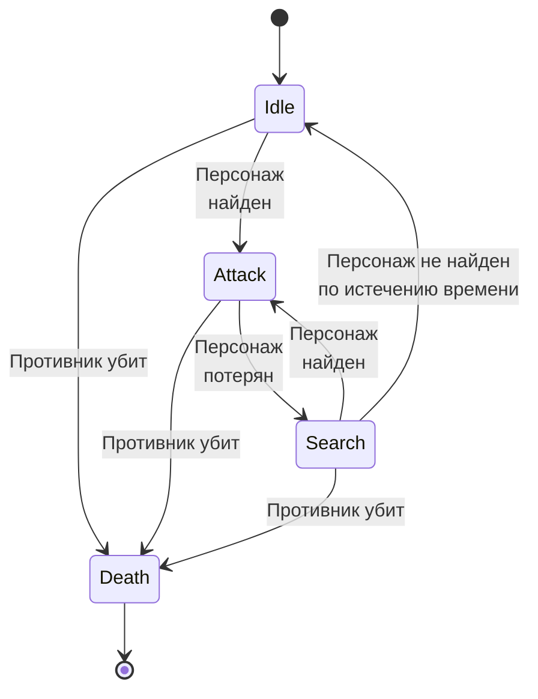
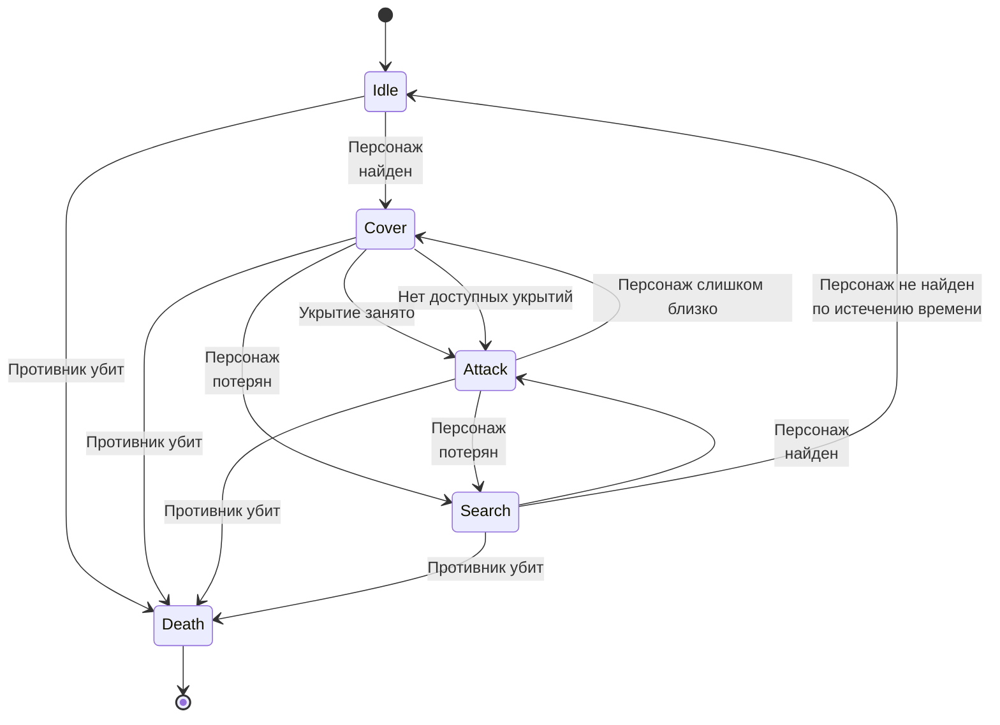

[[Агрессивный ИИ]]
### Описание
Противники на локации генерируются случайно вместе с комнатами. 
Изначально противникам могут быть назначены Idle задачи, например, стоять и охранять проход, патрулировать определенную местность, взаимодействовать с объектами, проигрывать анимацию и т.д.

Противники могут объединяться в [[Формации|формации]] и тем самым становиться сильнее.

Противники реагируют на персонажа и на другие раздражители, например громкие звуки, выстрелы.

Противники бывают разные. Они могут отличаться моделью, поведением и оружием.
### Возможности
- Противники могут использовать своё оружие против персонажа. 
- У каждого противника доступно только одно оружие. 
- Патроны у противников бесконечные. 
- Между выстрелами есть КД/перезарядка.
  
- Противники могут оповещать других противников о расположении персонажа

Действия противников задаются с помощью конечного автомата, например: 

#### Дальнобойные противники 
Находясь вблизи персонажа попытаются отойти подальше.
При виде персонажа попытаются занять укрытие.
> Граф неправильно отрендерился, обратитесь к исходному коду ниже, чтобы не возникало путаницы
```
stateDiagram
    [*] --> Idle 
    Idle --> Cover: Персонаж <br > найден
    Cover --> Attack: Укрытие занято
    Cover --> Attack: Нет доступных укрытий
    Attack --> Cover: Персонаж слишком близко

    Search --> Attack:  Персонаж <br > найден
    Cover --> Search: Персонаж <br > потерян
    Attack --> Search: Персонаж <br > потерян

	Search --> Idle: Персонаж не найден <br > по истечению времени

    Idle --> Death: Противник убит
    Cover --> Death: Противник убит
    Attack --> Death: Противник убит
    Search --> Death: Противник убит
    Death -->[*]
```


