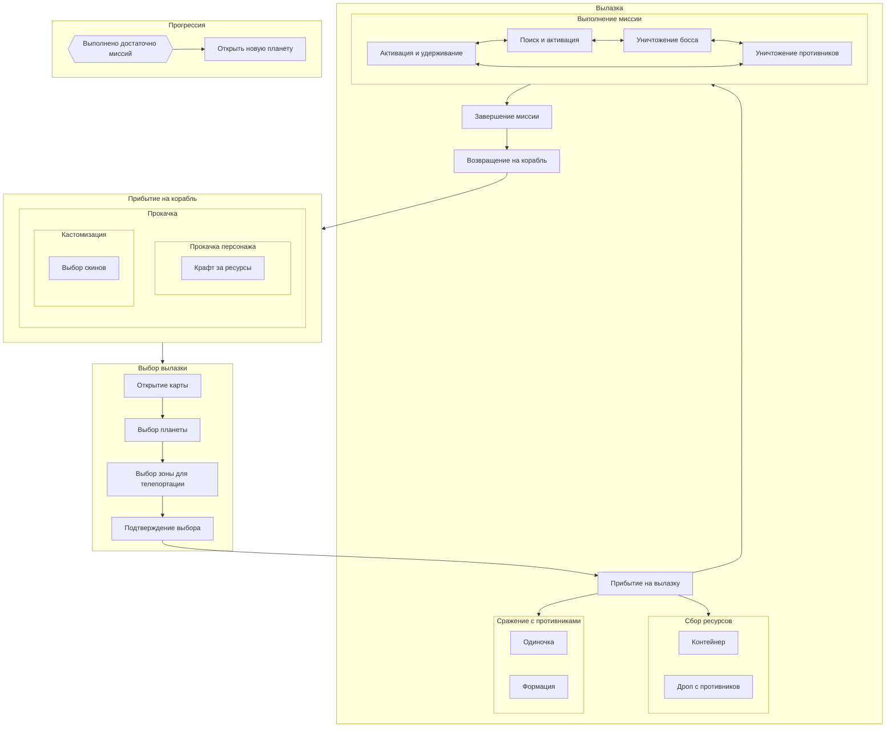

```mermaid
graph TD
    subgraph ONE[Прибытие на корабль]
        direction LR
        subgraph ONE_ONE[Прокачка]
            subgraph ONE_ONE_TWO[Прокачка персонажа]
                O111[Крафт за ресурсы]
            end
            subgraph ONE_ONE_THREE[Кастомизация]
                O113[Выбор скинов]
            end
            
        end
    end


    subgraph TWO[Выбор вылазки]
        G[Открытие карты]
        G --> H[Выбор планеты]
        H --> I[Выбор зоны для телепортации]
        I --> J[Подтверждение выбора]
    end
    
    subgraph Three[Вылазка]
        J --> T2[Прибытие на вылазку]
        T2 --> T3
        subgraph T3[Выполнение миссии]
            direction RL
            T31[Уничтожение противников]
            T32[Уничтожение босса]
            T33[Поиск и активация]
            T34[Активация и удерживание]
            T31 <--> T32 <--> T33 <--> T34 <--> T31
        
        end
        T2 --> T7
        subgraph T7[Сбор ресурсов]
            T71[Контейнер]
            T72[Дроп с противников]
        end
        T2 --> T8
        subgraph T8[Сражение с противниками]
            T81[Одиночка]
            T82[Формация]
        end
        T3 --> T4[Завершение миссии]
        T4 --> T5[Возвращение на корабль]

    end

    subgraph FOUR[Прогрессия]
         O{{Выполнено достаточно миссий}}
         O --> O1[Открыть новую планету]

    end

    T5  --> ONE
    ONE --> TWO


```

